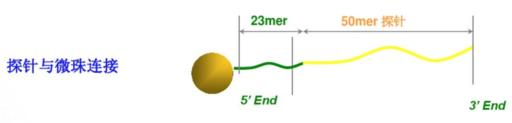

```{r setup, include=FALSE}
options(htmltools.dir.version = FALSE)
```

class: center, middle

background-image: url(images/DNA_microarray.png)
background-size: 190px
background-position: 50% 25%

<br/><br/><br/><br/><br/><br/>
# DNA微阵列（基因芯片）

### /DNA Microarrays/

---

## 导言

[DNA微阵列](https://en.wikipedia.org/wiki/DNA_microarray) (DNA Microarrays)技术/基因芯片（Genechip）技术是一种在上世纪80年代开始研制，90年代成熟和推广并得到广泛应用的生物学检测技术。目前英文中大多使用DNA微阵列（DNA Microarrays）来表示基因芯片，而Genechip已经被美国[昂飞（Affymetrix）公司](https://en.wikipedia.org/wiki/Affymetrix)申请商用专利。

DNA微阵列（基因芯片）技术的出现是生物学相关领域的一个里程碑事件。它使得生物学、医学等领域研究快速发展，与之相关的科学论文数以万记（未统计具体数字，表示很多的意思）。而且，这项产生于上个世纪的基因芯片技术目前仍然是生物科学领域最具应用价值的技术之一（80年代-克隆，90年代-PCR，21世纪-芯片）。

DNA微阵列（基因芯片）技术和传统的[Southern杂交](https://baike.baidu.com/item/southern印迹杂交)、[Northern杂交](https://baike.baidu.com/item/northern%E5%8D%B0%E8%BF%B9%E6%9D%82%E4%BA%A4)等技术一样，均基于核酸之间的互补结合特性开发，但是传统技术只能针对单个基因来分析，而微阵列技术则开启了高通量模式。

如果是第一次接触这个概念，你可以先简单的把微阵列理解成是一种和计算机芯片（如[中央处理器，Central Processing Unit，CPU](https://en.wikipedia.org/wiki/CPU)）在体积上类似（都很小），并主要用于定性或定量测定生命体内物质的检测技术。区别在于微阵列（如DNA Microarrays）并不能用来进行加减乘除等数学运算，而CPU可以）。

---

## 导言

### 所涉及的名词和技术

如果你有知识体系构建的习惯，可以将这次所要学习的内容大致与以下名词做一些关联：

- 生物学
- 生物学过程
- 基因及其产物
- 标记、杂交以及显微成像技术
- 定性和定量检测技术
- 计算机自动处理技术
- ......

相关知识所依赖的场所：

- 生物体内（in vivo）
- 生物体外（in vitro）
- 计算机内（in silico）

---

## 导言

### 学习它的重要性

如果你参加过与生物信息学相关的培训或者导读课程，就会知道，DNA微阵列（基因芯片）技术常常是作为这些课程的必修内容之一。

- 通过学习**DNA微阵列（基因芯片）技术**的相关概念、基本原理、数据分析方法及其注意事项，将是你入门[生物信息学](https://en.wikipedia.org/wiki/Bioinformatics)的最好的一次机会。

- 了解芯片技术有助于大家进一步学习生物信息学涉及到的其他新型技术，比如全外显子测序和靶向测序、全基因组测序、全转录组测序、单细胞测序等。

- 在学习相关的数据分析过程中，你将会积累一部分编程经验（如R和Bash），这对于以后熟练掌握编程技术也非常有意义。而编程技术的掌握与否则是衡量一个人生物信息学入门的最基本的指标之一。

- 掌握它之后，你可以利用公共芯片数据进行数据挖掘，用于验证你的想法或者发现新的知识。你现在可以搜索一下[GEO（Gene Expression Omnibus）](https://www.ncbi.nlm.nih.gov/geo)中和微阵列（基因芯片）相关的数据，试着回答一下上面的数据都有哪些类型？

---

## 导言

### 两个“简单”问题

- 生物和非生物体的主要区别在哪里？

- 生物体内的遗传信息传递依赖哪些物质？它的流动顺序是怎样的？

我建议在这里你可以稍微发动一下你的想象力，尽量基于你已有的知识或者凭空猜一猜看。

如果你已经有自己的答案或者实在想不出来则可以继续往下（这样会加深你对这两个问题的印象）。

---

## 导言

#### 生物和非生物体的主要区别在哪里？

生物的九大基本特征：

1. 生物体具有<u>**严整的结构**</u>（细胞是生物体结构和功能的基本单位）。
2. 生物体能进行新陈代谢。
3. 生物体能生长。
4. 生物体具有应激性。
5. 生物体能生殖和发育。
6. 生物体具有<u>**遗传和变异**</u>的特性。
7. 生物体能在一定程度上适应环境并影响环境。
8. 生物体能跟外界进行物质交换。
9. 生物体可以呼吸。

---

## 导言

#### 生物和非生物体的主要区别在哪里？

自主阅读，并回答：

- 生物、细胞、遗传物质以及代谢产物之间的关系？
- 生物主要分为几大类？人属于哪一类？
- 真核生物和原核生物的区别有哪些？它们的遗传物质的种类是否相同？
- 病毒属不属于生物？它有没有遗传物质？如果它不属于生物，原因是什么？
- 微生物能不能呼吸？它的呼吸方式有哪些？

---

## 导言

#### 生物体内的遗传信息传递依赖哪些物质？它的流动顺序是怎样的？

这里要引入一个非常重要的概念：[中心法则](https://en.wikipedia.org/wiki/Central_dogma_of_molecular_biology)：生物体内的遗传信息沿着DNA-RNA-蛋白质轴流动，DNA->DNA：DNA复制，DNA->RNA：转录，RNA->RNA：RNA复制，RNA->DNA：逆转录，RNA->蛋白质：翻译。掌握这个生物体内的信息流动过程对于你理解基因芯片技术有重要帮助。

补充一点，以后你会经常碰到“[扩增（amplification）](https://en.wikipedia.org/wiki/Gene_amplification)”这个概念，其实它主要对应于中心法则中的**DNA**复制过程，如基因芯片技术大多有互补脱氧核糖核酸（complementary DNA，cDNA）的<u>**扩增**</u>步骤。

.center[


**图一** 真核生物的中心法则示意图（DNA，RNA和蛋白质）。
]


---
background-position: 50% 50%
class: center, middle, inverse

### 现在开始

你好，DNA微阵列/基因芯片（DNA Microarray）世界

---

## 什么是微阵列？

微阵列的概念和方法（抗体微阵列，也称为抗体基质）最早由[Tse Wen Chang](https://en.wikipedia.org/wiki/Tse_Wen_Chang)于在1983年发表在[《J Immunol Methods》](https://www.ncbi.nlm.nih.gov/pubmed/6606681)的科学论文进行了论述。

微阵列主要是基于固体基质（通常是载玻片或硅薄膜）上的**二维**阵列，使得人们可以高通量地定性或定量的测定生物分子（如DNA、RNA、蛋白质等）。

.center[


**图二** 抗体微阵列示意图
]
---

## 微阵列的分类

微阵列主要类型包括：

- [Antibody microarrays](https://en.wikipedia.org/wiki/Antibody_microarray)
- [DNA microarrays](https://en.wikipedia.org/wiki/DNA_microarray)：如cDNA微阵列, 寡核苷酸微阵列, BAC微阵列和SNP微阵列
- [MMChips](https://en.wikipedia.org/wiki/MMChip), 用于检测[microRNA](https://en.wikipedia.org/wiki/MMChip)
- [Protein microarrays](https://en.wikipedia.org/wiki/Protein_microarray)
- [Peptide microarrays](https://en.wikipedia.org/wiki/Peptide_microarray), 用于分析蛋白质-蛋白质相互作用
- [Tissue microarrays](https://en.wikipedia.org/wiki/Tissue_microarray)
- [Cellular microarrays](https://en.wikipedia.org/wiki/Cellular_microarray)，又称转染微阵列
- [Chemical compound microarrays](https://en.wikipedia.org/wiki/Chemical_compound_microarray)
- [Glycan arrays (carbohydrate arrays)](https://en.wikipedia.org/wiki/Glycan_array)
- [Phenotype microarrays](https://en.wikipedia.org/wiki/Phenotype_microarray)
- [Reverse phase protein lysate microarrays, microarrays of lysates or serum](https://en.wikipedia.org/wiki/Reverse_phase_protein_lysate_microarray)
- [Interferometric reflectance imaging sensor (IRIS)](https://en.wikipedia.org/wiki/IRIS_%28Biosensor%29)

这里可以看到，微阵列技术除了使用DNA、RNA、蛋白质，还可以使用其他诸如比DNA等大一点的组织、细胞，或者更小一点的肽、碳水化合物等物质。你需要记住的是DNA和RNA是基因芯片技术使用最多的两种物质，后面我们将对[DNA微阵列（基因芯片）](https://en.wikipedia.org/wiki/DNA_microarray)进行部分展开。如果想了解其他芯片技术，你可以快速地比较一下其他微阵列技术，如[蛋白质微阵列](https://en.wikipedia.org/wiki/Protein_microarray)和[肽微阵列](https://en.wikipedia.org/wiki/Peptide_microarray)。

---

## DNA微阵列（基因芯片）

DNA微阵列（基因芯片）是属于微阵列技术应用中的一种，主要是用于定性或定量测量存在于生物体内的<u>**核酸**</u>。其用于定性和定量的探针由数kb（cDNA芯片）或者几十个（寡核苷酸）特定类型的核苷酸所构成。该技术之所以可行的一个重要原理就是碱基之间的互补配对作用，以及互补的核苷酸单链间的杂交作用。

### DNA微阵列（基因芯片）的发展历史

上个世纪80年代中期提出基因芯片的原型开始，因其依赖的相关技术还不成熟，基因芯片技术还一直处于实验室阶段，并未进行大规模商用。

1991年，美国的Affymetrix公司开始进一步对基因芯片技术进行研发。次年（1992年）Affymetrix公司制成了首张商业化[寡核苷酸](https://baike.baidu.com/item/寡核苷酸/1133384)芯片，并使用前面提到的[Genechip](https://en.wikipedia.org/wiki/Affymetrix)作为其基因芯片的商业名称。

在1995年斯坦福大学的 Ron Davis and Pat Brown 实验室首次在《Science》杂志上发表基因表达 谱芯片的论文之后，DNA微阵列即基因芯片技术开始迎来它的黄金发展期。

---

## DNA微阵列（基因芯片）

1996年，Affymetrix公司运用激光共聚焦及分子生物学技术研制出首块**<u>cDNA</u>**芯片，从此拉开了基因芯片技术研究与开发的帷幕，这一年也被称为基因芯片的元年。[Affymetrix（昂飞）](https://www.affymetrix.com)，[Agilent（安捷伦）](https://www.agilent.com/)，[Illumina](https://www.illumina.com.cn/)等商业公司的成立对于基因芯片技术的进一步和大范围推广应用发挥了重要作用。

1998年，美国科学促进会将基因芯片技术列为年度自然科学领域十大进展之一，同年美国政府正式启动生物芯片计划。

2001年人类第一个基因组发布之后，随着二代测序技术时代的到来，在一部分生物检测领域（如基因表达谱分析）逐渐替代了基因芯片成为首选技术（如全转录组测序）。

2016年占据基因表达谱芯片市场绝大多数份额的美国Affymetrix（昂飞）公司被另一家美国公司**赛默飞**世尔科技（Thermo Fisher Scientific）以13亿美元的价格收购。

---

## DNA微阵列（基因芯片）

.center[


**图三** Affymetrix（昂飞）基因芯片实物图

左：Human Genome U133 Plus 2.0 右：Mouse Genome 430 2.0
]

---

## DNA微阵列（基因芯片）

### 应用场景及其技术路线

.r_resources_table_1[
应用|概要
---|---
基因表达谱 |	在mRNA或基因表达谱分析中，同时监测数千个基因的表达水平以研究某些治疗，疾病和发育阶段对基因表达的影响。例如，通过比较感染的基因表达与未感染的细胞或组织中的基因表达，可以使用基于微阵列的基因表达谱来鉴定其表达响应于病原体或其他生物而改变的基因。
比较基因组 |	评估不同细胞或密切相关的生物体中的基因组含量。
GeneID |	小型微阵列检查食品和饲料中的生物ID（如GMO），细胞培养中的支原体或疾病检测的病原体，主要是结合PCR和微阵列技术。
]
---

## DNA微阵列（基因芯片）

### 应用场景及其技术路线

.r_resources_table_2[
应用|概要
---|---
染色质免疫沉淀 |	可以通过免疫沉淀该蛋白质（ChIP）来分离与特定蛋白质结合的DNA序列，然后可以将这些片段与微阵列（例如平铺阵列）杂交，从而允许确定整个基因组中的蛋白质结合位点占据。实验蛋白免疫沉淀是组蛋白修饰（H3K27me3，H3K4me2，H3K9me3等），Polycomb-组蛋白（PRC2：Suz12，PRC1：YY1）和trithorax-组蛋白（Ash1）来研究表观遗传景观或RNA聚合酶II来研究该转录景观。
DamID	| 类似于ChIP，可以分离由目的蛋白质结合的基因组区域并用于探测微阵列以确定结合位点。与ChIP不同，DamID不需要抗体，而是利用蛋白质结合位点附近的腺嘌呤甲基化来选择性扩增这些区域，并通过表达与细菌DNA腺嘌呤甲基转移酶融合的微量目的蛋白质而引入。
]
---

## DNA微阵列（基因芯片）

### 应用场景及其技术路线

.r_resources_table_2[
应用|概要
---|---
单核苷酸多态性（SNP）检测	| 鉴定群体内或群体之间的等位基因之间的单核苷酸多态性。微阵列的几种SNP检测方向：包括基因分型，法医分析，测量疾病易感性，鉴定候选药物，评估个体中的种系突变或癌症中的体细胞突变，评估杂合性缺失或遗传连锁分析。
瓦片阵列	| 基因组瓦片阵列由重叠探针组成，设计可以覆盖感兴趣的基因组区域的密集探针，如整个人类染色体。如检测已知的或者先前未知/预测的剪接形式、全基因组甲基化芯片等。
]
---
## DNA微阵列（基因芯片）

### 应用场景及其技术路线

.r_resources_table_2[
应用|概要
---|---
可变剪接检测 |	用于检测已知的或潜在的RNA可变剪接位点。用户可以为每个基因设计1-3个探针或者每个基因设计数百或数千个探针（如瓦片阵列）。从而用于检测基因发生可变剪接后的特定形式的RNA表达水平。
融合基因检测 |	融合基因微阵列可以检测例如来自癌症样本的融合转录本。原理和可变剪接检测类似，区别在于融合基因检测发生在两个基因的情况，即在设计寡核苷酸探针时需要考虑两个基因的外显子序列。
双链B-DNA检测 |	右手双链B-DNA微阵列可用于设计结合固定的，完整的双链DNA的特定区域的新药物和生物制品。比如设计相应结合物后可以用于抑制基因表达。
]
---

## DNA微阵列（基因芯片）

### 应用场景及其技术路线

.r_resources_table_2[
应用|概要
---|---
双链Z-DNA检测 |	左手双链Z-DNA微阵列可用于鉴定位于右手B-DNA基因的较长区段内的备选Z-DNA结构的短序列（例如，转录增强，重组，RNA编辑）。
多链DNA检测 |（triplex-DNA微阵列和quadruplex-DNA微阵列）	多链DNA和RNA微阵列可用于鉴定与这些多链核酸序列结合的新药物。该方法可用于发现具有抑制基因表达能力的新药物和生物制剂。 
]

来源：[Wiki](https://en.wikipedia.org/wiki/DNA_microarray)

**扩展阅读：** 

- Schena, M.; Shalon, D.; Davis, R. W.; Brown, P. O. (1995). "Quantitative Monitoring of Gene Expression Patterns with a Complementary DNA Microarray". Science. 270 (5235): 467–70. 

---
## DNA微阵列（基因芯片）

### cDNA基因芯片和寡核苷酸基因芯片

项目|cDNA芯片|<u>短寡核苷酸芯片</u>|长寡核苷酸芯片
---|---|---
探针长度 | 0.5~3kb |15-25bp | 45-70bp 
mRNA表达谱分析 | ++ | ++ | ++
区分基因型 | - | ++ | +
检测可变剪接 | - | ++ | +++
点阵一致性 | - | ++ | +++
目前应用 | + | +++ | ++
批量生产一致性 | - | ++ | ++++
芯片成本 | 适中 | 较高 | 较低
---
## DNA微阵列（基因芯片）

.center[


**图四** [基因芯片](https://en.wikipedia.org/wiki/DNA_microarray)流程概览（一）
]

---
## DNA微阵列（基因芯片）

.center[


**图五** [基因芯片](https://en.wikipedia.org/wiki/DNA_microarray)流程概览（二）


**图六** [基因芯片](https://en.wikipedia.org/wiki/DNA_microarray)标记后核酸杂交示意图

]

---

## DNA微阵列（基因芯片）

.center[


**图七** Affymetrix Human Genome U133A基因芯片示意图
]
---

## DNA微阵列（基因芯片）

### Affymetrix 原位光刻技术

美国著名的Affymetrix公司率先开发了寡聚核苷酸原位光刻技术，并申请相关专利。它是生产高密度寡核苷酸基因芯片的核心关键技术。该技术的最大优点在于用很少的步骤可合成大量的DNA阵列（<u>主要步骤：固基羟基化-光敏基团保护-避光膜透光聚合-光照活化-碱基结合-反应合成-不断循环</u>）。Affymetrix的[原位合成](https://baike.baidu.com/item/%E5%8E%9F%E4%BD%8D%E5%90%88%E6%88%90%E6%8A%80%E6%9C%AF/22293423)技术可制作的点阵密度高达10^6~10^10/cm^2。

.center[


**图八** Affymetrix原位光刻技术示意图
]
---

## DNA微阵列（基因芯片）

### Affymetrix PM-MM探针设计

采用PM-MM配对设计探针的目的是为了提高芯片技术检测结果的灵敏度和特异度。

Affymetrix在探讨了各种各样的影响因素后，设计出了一种独特的PM-MM探针方案。芯片上的每一个基因或EST都是由一个或几个探针组(probe set)组成，每组探针组又由11-20对25mer的探针对(probe pair)组成，每探针对包括两个探针池(probe cell)，其中一个是完全匹配（Perfect-Match，PM）的，另外一个是序列中间有一个碱基错配的(Mis-match，MM)。

通过多个短核苷酸片段可以有效区分同源片段，避免了同源片段的结合导致的假阳性和错误。

一般使用25mer长度的寡核苷酸。因为在该长度下，信号强度和分辨率达到平衡，有一个碱基发生错配，杂交复合物就会变得很不稳定。<u>**如果长度达到60mer，就无法区分序列上十分接近的序列</u>**，即有错配碱基仍然会进行结合。

---
## DNA微阵列（基因芯片）

### Affymetrix PM-MM探针设计

.center[


**图九** Affymetrix PM-MM探针设计示意图
]
---

## DNA微阵列（基因芯片）

### illumina BeadArray光纤微珠

Illumina的芯片产品采用了另外的一种技术：[BeadArray光纤微珠](https://academic.oup.com/nar/article/38/3/e17/3112385)。

.center[


**图十** Illumina基因芯片的微珠结构：每个微珠上会连接100万个左右相同的探针
]
---

## DNA微阵列（基因芯片）

### illumina BeadArray光纤微珠

.center[


**图十一** Illumina基因芯片Beadarry示意图

]
---

## DNA微阵列（基因芯片）

### 双通道和单通道

从双通道（cDNA芯片）到单通道（寡核苷酸芯片）是基因芯片技术发展进程中重要进步之一。

- 双通道主要用于**<u>cDNA芯片</u>**，即用两种荧光的比值反应基因表达水平（红色通道和绿色通道），比如处理前用一种荧光标记，处理后用另一种荧光标记，二者竞争性杂交。
- 单通道是指只用一种标记物标记，点的荧光强度可以反映基因表达水平，如寡核苷酸芯片Affymetrix。

**标准化：** 在芯片实验中，各个芯片的绝对光密度值是不一样的，在比较各个芯片结果之前必需将其归一化（normalization，也称作标准化）。在同一块芯片上杂交的、由不同荧光分子标记的两个样品间的数据即双通道数据，也需归一化。标准化的概念现在只要记住一点：在数据分析时需要利用某些算法对不同芯片或者同一芯片不同通道的数据进行统一，从而使其之间可以进行比较。

双通道到单通道数据的的**<u>标准化</u>**适用的标准化算法不完全一致。相关标准化算法资料可以在提供的后续阅读材料中获取。

---

## DNA微阵列（基因芯片）

### 依赖的其他技术

一项技术的产生，其往往依靠的是大量前期人们所积累的其他技术基础之上，这和一项科研成果大多需要基于前人的工作一样。基因芯片技术的产生也得益于其他相关技术的发明和发展。

#### PCR技术

上世纪80年代，在分子生物学领域有一个家喻户晓的技术被发明——-聚合酶链式反应([Polymerase Chain Reaction，PCR](https://en.wikipedia.org/wiki/Polymerase_chain_reaction))。它可以以指数级别扩增特定DNA片段的单拷贝或几个拷贝，以产生数千至数百万拷贝的特定DNA序列。而在基因芯片进行样品检测时，常常需要将目标核酸进行大量扩增以使得其可以达到被检测的水平。以后你遇到的很多其他生物学检测技术（如高通量测序技术）也会常常用到这个技术。

PCR技术由[Kary Mullis](https://en.wikipedia.org/wiki/Kary_Mullis)在1983年发明。10年之后的1993年，Kary Mullis和[Michael Smith](https://baike.baidu.com/item/%E8%BF%88%E5%85%8B%E5%B0%94%C2%B7%E5%8F%B2%E5%AF%86%E6%96%AF/7471104)一起荣获当年诺贝尔化学奖，后者主要是奖励其发明的[寡聚核苷酸定点诱变](https://en.wikipedia.org/wiki/Site-directed_mutagenesis)技术。

---

## DNA微阵列（基因芯片）

### 依赖的其他技术

#### 标记技术

除了PCR技术很重要之外，另一个也是基因芯片检测试验必不可少的：标记技术。目前在基因芯片产品中常用到的两种标记物：

- [荧光分子直接标记](https://baike.baidu.com/item/荧光探针)
- [生物素标记](https://baike.baidu.com/item/生物素标记核酸探针技术)

通过标记物标记之后的核酸才有可能被我们的基因芯片仪器所检测到，后面的数据分析中定量分析，如确定基因表达水平的高低，也主要依靠的是标记物所产生的信号强弱来计算。

---

## DNA微阵列（基因芯片）

### 依赖的其他技术

#### 高精度机械臂

基因芯片和计算机芯片类似，都是在很小的容积内进行很多高精度操作。特别是cDNA芯片，它需要先合成大量的长片段核酸，然后通过注射入芯片上相应的位置。

#### 显微镜和光传感技术

单单只有标记好的核酸是产生不了数据的，需要一个扫描装置来将阵列上的斑点（核酸标记产生光的强弱变化）将光信号转变为电信号。而能够完成扫描工作的装置就是利用显微镜和光传感技术的各类显微镜。

- 激光扫描荧光显微镜
- 激光扫描共焦显微镜
- CCD相机的荧光显微镜

---

## DNA微阵列（基因芯片）

### 依赖的其他技术

#### 显微镜和光传感技术

这里强调一点：对于上世纪基因芯片技术广泛应用的最重要的显微镜类型是**<u>激光扫描共焦显微镜</u>**。激光扫描共焦显微镜与激光扫描荧光显微镜相比，尽管二者结构类似，但是前者可以在荧光标记分子与DNA芯片杂交的同时进行杂交信号的探测，而无须清洗掉未杂交分子，从而简化了操作步骤大大提高了工作效率。
---

## DNA微阵列（基因芯片）

### 其他

- 扫描仪：用于检测和量化微阵列载玻片上斑点荧光强度的仪器，通过激光选择性激发荧光团并用滤光片（光学） 光电倍增管系统测量荧光。
- 通道：扫描仪中记录的荧光输出，用于单个荧光团，甚至可以是紫外线。
- 斑点或特征：阵列固相载体上的一个小区域，包含微量的特定DNA样本。
- 病例/对照：特别适用于双色阵列系统的实验设计范例，其中将选择作为对照的病症（例如健康组织或状态）与改变的病症（例如患病组织或状态）进行比较。
- 数据托管网站：目前最大的基因芯片数据存储仓库为[美国国立卫生研究院](http://www.nih.gov/)（USA National Institutes of health，NIH）资助建立的[Gene Expression Omnibus
（GEO）](https://www.ncbi.nlm.nih.gov/geo/)数据库。

---
## DNA微阵列（基因芯片）

### 其他

- 用到的文件格式：.EXP：包含实验的基本信息，.DAT：芯片的扫描图像，**.CEL：** 特征的初始量化（每个探针的荧光强度），.CDF：探针在芯片中的定位信息，探针到探针组的映射，.CHP：包含基因表达水平（用affy软件评估）
- 探针注释文件：一个数据文件存储了基因探针（如1303_at）与人类可读的基因名字（如SH3BP2，SH3 Domain Binding Protein 2）间的对应关系
- 批次效应（batch effect）：因试验或者数据分析引入的非生物学效应，即相同样品进行多次检验，结果出现差异，当差异程度较大时会影响最终的生物学结论（如[这篇论文](http://www.pnas.org/content/111/48/17224)）。
- 数据下载工具：R包（[GEOquery](http://www.bioconductor.org/packages/release/bioc/html/GEOquery.html)）
- 数据原始格式：`.CEL`后缀文件（为探针检测数据，非基因表达值）。
- 数据分析工具：R包（[affy](http://bioconductor.org/packages/release/bioc/html/affy.html)，[CLL](http://bioconductor.org/packages/release/data/experiment/html/CLL.html)，[simpleaffy](http://www.bioconductor.org/packages/release/bioc/html/simpleaffy.html)，[affyPLM](http://bioconductor.org/packages/release/data/experiment/html/affyPLM.html)，[gcrma](http://www.bioconductor.org/packages/release/bioc/html/gcrma.html)，[affycoretools](http://www.bioconductor.org/packages/release/bioc/html/affycoretools.html)，[limma](http://www.bioconductor.org/packages/release/bioc/html/limma.html)， [annotate](http://www.bioconductor.org/packages/release/bioc/html/annotate.html)， [hgu133plus2.db](http://www.bioconductor.org/packages/release/data/annotation/html/hgu133plus2.db.html)，
[GOstats](http://bioconductor.org/packages/release/bioc/html/GOstats.html)， [GeneAnswers](http://www.bioconductor.org/packages/release/bioc/html/GeneAnswers.html)， [gplots](https://cran.r-project.org/web/packages/gplots/index.html)， [pheatmap](https://cran.r-project.org/web/packages/pheatmap/index.html)，[clusterProfiler](http://bioconductor.org/packages/release/bioc/html/clusterProfiler.html)）

---

## 其他阅读资料

通过以上内容，我相信你对基因芯片技术已经有了一些初步的了解。如果你仍然感兴趣，或者希望进一步深入学习，你可能需要集中阅读大量相关资料（即主题阅读）。下面列出的一些链接，中文资料只简单在一些平台搜索了关键字，英文资料则进行了[汇总](https://github.com/Miachol/ftp/tree/master/reading/microarray)。

开始阅读其它资料之前，你可以点击[这里](https://learn.genetics.utah.edu/content/labs/microarray/)进行虚拟实验，体验你的第一次虚拟基因芯片实验操作和数据分析（双通道芯片）。

#### 中文

- [微信公众号](https://weixin.sogou.com/weixin?type=2&query=基因芯片+生信技能树)
- [简书](https://www.jianshu.com/search?q=基因芯片)
- [知乎](https://www.zhihu.com/search?type=content&q=%E5%9F%BA%E5%9B%A0%E8%8A%AF%E7%89%87%E6%95%B0%E6%8D%AE%E5%88%86%E6%9E%90)
- [CSDN](https://so.csdn.net/so/search/s.do?q=基因芯片)

---
## 其他阅读资料

#### 英文

- [PPT - Introductio to microarrays (1)-Basic concepts-software-and-annotations](https://raw.githubusercontent.com/Miachol/ftp/master/reading/microarray/0-Introduction_to_microarrays_2_Overview_of_analysis-limitations_and_extensions_NGS.pdf)
- [PPT - Introduction to microarrays (2)-Overview of analysis -limitations and extensions (NGS)](https://raw.githubusercontent.com/Miachol/ftp/master/reading/microarray/0-Introduction_to_microarrays_Basic_concepts-software-and-annotations.pdf)
- [A Biologist’s Guide to ANALYSIS OF DNA MICROARRAY DATA](https://raw.githubusercontent.com/Miachol/ftp/master/reading/microarray/0471227587.pdf)
- [Microarray data analysis: from disarray to consolidation and consensus](https://raw.githubusercontent.com/Miachol/ftp/master/reading/microarray/allison2006.pdf)
- [A Tutorial Review of Microarray Data Analysis](https://raw.githubusercontent.com/Miachol/ftp/master/reading/microarray/A_Tutorial_Review_of_Microarray_data_Analysis_17-06-08.pdf)
- [Quality Assurance Methods for Processing Microarray Imagery](https://raw.githubusercontent.com/Miachol/ftp/master/reading/microarray/PB-20020803-1.pdf)
- [Image-Based Visualization of Microarray Features and Classification Results](https://raw.githubusercontent.com/Miachol/ftp/master/reading/microarray/PB-20020804-1.pdf)
- [cDNA Microarray Data Analysis Methods: A Review](https://raw.githubusercontent.com/Miachol/ftp/master/reading/microarray/ekar06.pdf)
- [Applied Statistics for Bioinformatics using R](https://raw.githubusercontent.com/Miachol/ftp/master/reading/microarray/Krijnen-IntroBioInfStatistics.pdf)
- [Handout for ISMB 2008 tutorial: ‘Introduction to microarray analysis’](https://raw.githubusercontent.com/Miachol/ftp/master/reading/microarray/Handout_for_ISMB_2008_tutorial_Introduction_to_mi.pdf)
- [An Introduction to Microarray Data Analysis and Visualization](https://raw.githubusercontent.com/Miachol/ftp/master/reading/microarray/1-s2.0-S0076687910700021-main.pdf)
---

## 练习（简答题）

- 什么是微阵列？微阵列有哪些类型？
- 什么是基因芯片？基因芯片有哪些类型？
- 基因表达芯片最受欢迎的型号有哪些？它们的生产厂商分别是？
- 其他种类的芯片（如SNP、miRNA、甲基化等）中比较受欢迎的芯片型号有哪些？
- cDNA芯片和寡核苷酸芯片的区别有哪些？
- 公共的基因芯片数据一般存放于哪一个网站？该网站由哪国的哪个机构资助？
- 基因芯片检测的基本实验流程？
- 基因芯片数据涉及的文件类型有哪些？分别有什么作用？
- 基因芯片数据中用于将探针荧光数据转换为基因表达矩阵的R包是哪一个？
- 可以用于基因芯片数据的基因差异表达分析的R包有哪些？
- 可以用于基因芯片数据的热图可视化的R包有哪些？

---

## 练习（简答题）

- 基因芯片数据的质量控制主要有哪些步骤？
- RNA降解是否会影响基因芯片检测质量？反应在基因芯片数据中的荧光强弱有什么规律？
- 什么是MA图？全称是什么？
- 基因芯片的背景矫正和标准化分别是用来做什么的？
- 基因芯片数据的标准化的目的是什么？
- 你能查到的可以用于单通道和双通道基因芯片数据的标准化算法有哪些？
- 什么是批次效应？你能查到的用于处理基因芯片数据的R包有哪些？

---

## 练习（编程题）

- 学习[affy](http://bioconductor.org/packages/release/bioc/html/affy.html)，[CLL](http://bioconductor.org/packages/release/data/experiment/html/CLL.html)、[limma](http://www.bioconductor.org/packages/release/bioc/html/limma.html)、[gplots](https://cran.r-project.org/web/packages/gplots/index.html)， [pheatmap](https://cran.r-project.org/web/packages/pheatmap/index.html)，[clusterProfiler](http://bioconductor.org/packages/release/bioc/html/clusterProfiler.html)的使用，并分析CLL包中的CLLbatch数据集，得到灰度图像、相对对数表达箱线图（RLE）、热图。

---

class: center, middle

background-image: url(images/DNA_microarray.png)
background-size: 150px
background-position: 50% 7%

## 蟹蟹

希望这份PPT对你在基因芯片技术方面的学习有所帮助。

本幻灯片由 R 包 [xaringan](https://github.com/yihui/xaringan) 生成，并由 [remark.js](https://remarkjs.com)、[knitr](http://yihui.name/knitr)、以及 [R Markdown](https://rmarkdown.rstudio.com)提供主要渲染功能。

作者：[李剑峰](https://life2cloud.com)
