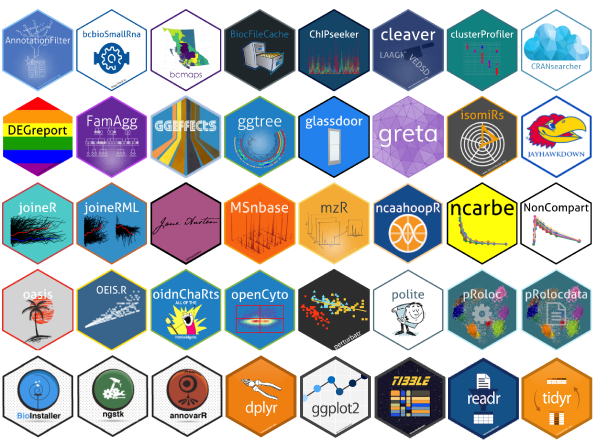
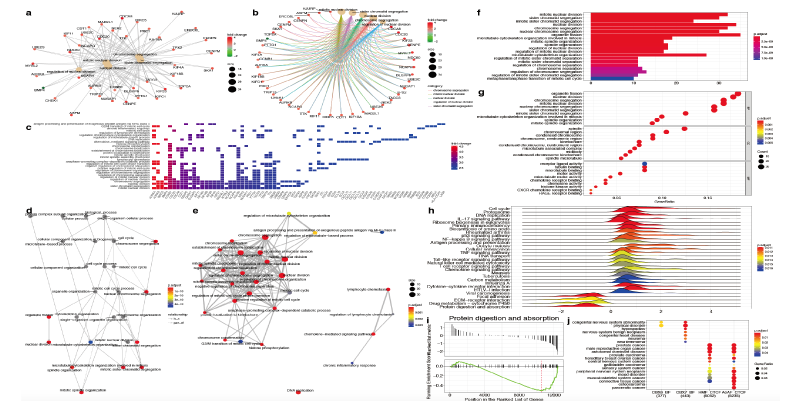
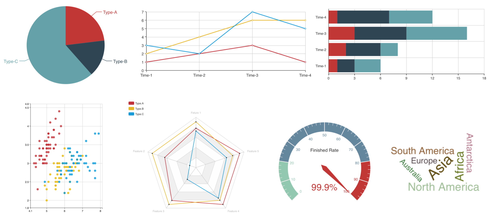
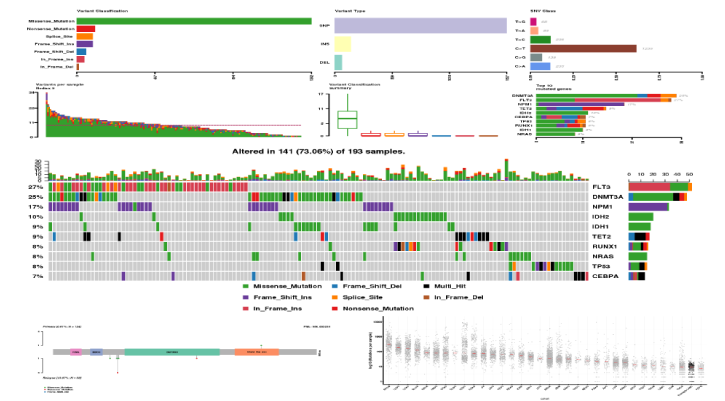

```{r setup, include=FALSE}
options(htmltools.dir.version = FALSE)
```

class: center, middle

background-image: url(images/R.png)
background-size: 200px
background-position: 48% 20%

# R语言

### /R Language/

---

## R语言的起源

R语言主要受[S语言](https://baike.baidu.com/item/S语言/2440117)（ 1976年John Chambers在贝尔实验室创建）和[Scheme语言](https://baike.baidu.com/item/Scheme/8379129)（20世纪70年代在麻省理工学院AI实验室的Guy L. Steele和Gerald Jay Sussman创建）影响发展而来，主要用户为统计学家和数据分析人员，常用于统计分析和图形可视化。早期R是基于S语言的一个GNU项目，所以也可以当作S语言的一种实现，通常用S语言编写的代码都可以不作任何修改的在R环境下运行。

.center[]

.center[**R**oss Ihaka和**R**obert Gentleman]
---

## R语言的起源

.r_resources_table_1[
版本号|日期|主要事件
---|---|---
alpha | 1997.04 | 由Ihaka和Gentleman主要开发的最后一个alpha版本的邮件列表于1997年4月1日开始。
0.49 | 1997.04 | 发布目前[CRAN](https://cran.r-project.org/)上最早的源版本0.49。
.60	| 1997.12	| R成为GNU项目的官方部分。代码在CVS上托管和维护。
0.65.1 |	1999.10 | 	update.packages和install.packages的第一个版本用于从CRAN下载和安装软件包。
1.0 |	2000.02 | 	其开发人员认为其稳定性足以供生产使用。
1.4 |	2001.12 | 	引入了S4方法，Mac OS X的第一个版本很快就可以使用了。
2.0	| 2004-10 | 	引入了延迟加载，可以以最小的系统内存开销快速加载数据。
2.1	| 2005-04 | 	支持UTF-8编码，以及不同语言的国际化和本地化的开始。
]

R本来是由来自新西兰奥克兰大学的**R**oss Ihaka和**R**obert Gentleman开发.[因两人名字都是以R 开头 所以也因此形象称为**R**。]

---
## R语言的起源

.r_resources_table_2[
版本号|日期|主要事件
---|---|---
2.11 |	2010-04 | 	支持Windows 64位系统。
2.13 |	2011-04 | 	添加一个新的编译器函数，允许通过将函数转换为字节代码来加速函数。
2.14 |	2011.10 | 	为包添加了强制名称空间。添加了一个新的并行包。
2.15 |	2012.03 | 	新的负载均衡功能。改进了长向量的序列化速度。
3.0	 | 2013.04 | 	支持64位系统上的数字索引值2的31次方或更大。
3.4	| 2017.04 | 	函数的即时编译（JIT）和默认启用的字节码循环。
3.5	| 2018.04 | 	默认情况下，包在安装时进行字节编译。紧凑的整数序列的内部表示。添加了新的序列化格式以支持紧凑的内部表示。
]

来源：Wiki百科
---

## R语言的应用

[R语言](https://en.wikipedia.org/wiki/R_(programming_language)的主要应用方向：统计分析（如统计检验）和数学建模、数据可视化以及其他（如数据收集与清洗、网页等交互式应用开发等）。

就统计分析和数学建模来看，R可与流行的商业统计软件包（如SAS，SPSS和Stata）相媲美，而且是完全免费的。

特别地，因用户贡献的第三方软件包的增长，R的应用范围得到了极大的扩展，R语言的用户数在近年来迅速增长。截至2018年8月，R在[TIOBE指数](https://www.tiobe.com/tiobe-index/)中排名第**18**位。

- [CRAN](http://cran.r-project.org)：**13095**（2018.09.25）
- [Bioconductor](http://www.bioconductor.org)：**2846**（2018.09.25）
- [GitHub](https://github.com/)、[GitLab](http://gitlab.com/)、[Bitbucket](https://bitbucket.org/product)等基于[Git](https://www.liaoxuefeng.com/wiki/0013739516305929606dd18361248578c67b8067c8c017b000)的软件仓库：未统计

其中Bioconductor主要存放与生命科学数据分析相关的R包，包括1562（Software）+ 921 （AnnotationData）+ 342 （ExperimentData）+ 21（Workflow）

如果你是统计学家、数学家、数据分析师、或者是科研人员，掌握R语言对你来说真的是非常有价值的一件事情。

注：[TIOBE指数](https://www.tiobe.com/tiobe-index/)用来衡量编程语言的流行程度。

---

## R语言的应用

.center[]

---

## R语言的应用

.center[]

.footnote[来源：[R : Graphics Tutorial Series \( Part 1 \)](http://www.linkedin.com/pulse/r-graphics-tutorial-series-part-1-anandh-shanmugaraj)]
---

## R语言的应用

.center[]

.footnote[来源：[clusterProfiler](https://github.com/GuangchuangYu/clusterProfiler)，[PDF](https://www.biorxiv.org/content/early/2018/02/01/256784.full.pdf)]

---

## R语言的应用

.center[]

来源：[ECharts](http://echarts.baidu.com/), [ECharts2Shiny](https://cran.r-project.org/web/packages/ECharts2Shiny/vignettes/intro.html)

**扩展阅读：** Tippmann S. Programming tools: Adventures with R[J]. Nature, 2015, 517(7532):109.

---

## R语言的应用

.center[]

.footnote[来源：[Maftools](https://github.com/PoisonAlien/maftools)，[教程](https://bioconductor.org/packages/release/bioc/vignettes/maftools/inst/doc/maftools.html)]

---
background-position: 50% 50%
class: center, middle, inverse

### 准备好了吗？

掌握这个可能会影响你一生的技能

---

## 预备知识

### 了解学习的过程

**学习的定义：** 如果一个系统（机器、人等）能够通过执行某个过程改进它的性能，这就是学习。

**人的学习路径：** 学习-实践-忘记-回顾。

**通用的学习技巧和原理：**

- 了解基本的概念是学习的第一步
- 基于你掌握的基本概念去比较、理解和学习有助于学习和理解新的概念
- 构建属于自己的知识框架来将零散的知识点进行整合将减少你的遗忘率
- 经过你深度思考和实践之后的知识印象最为深刻

如果你已经很久没有深度的思考过，请在这里停留一下：上面所列内容是否正确？是否还有其他技巧和原理可以帮助你学习一项新事物？对于[R语言](https://baike.baidu.com/item/R%E8%AF%AD%E8%A8%80/4090790?fr=aladdin)的学习，这些技巧和原理怎么应用？

**扩展阅读：** [娱乐至死](https://item.jd.com/11679294.html)，[简单的逻辑学](https://item.jd.com/11262696.html)
---

## 预备知识

### 什么是知识库？

通俗一点的讲，[知识库](https://en.wikipedia.org/wiki/Knowledge_base)（knowledge base）是一种可以让你在短时间内找到解决某些问题的工具和资源的集合。不管是个人，商业公司、政治团体或者国家主体都可以构建属于他们自己的知识库。

比如，基于计算机技术和网络的[互联网](https://en.wikipedia.org/wiki/Internet)就是目前最大的一种知识库。基于历史的原因，英语作为全世界使用范围最广的语言，其目前在互联网上的内容产出仍然占据主导地位。典型的就是科学论文的发表大多以英语为载体第一时间发表（知名的如Web of science数据库，又常被人叫做<u>**SCI**</u>数据库）。

当然，随着中国互联网的迅猛发展，中文资料目前也在变得丰富。据[统计](http://www.chyxx.com/industry/201708/549142.html)，2017年中国的网民人数已经达到<u>**7.5**</u>亿。有越来越多的以中文为载体的知识（包括R语言）在[知乎](https://www.zhihu.com)，[简书](https://www.jianshu.com/)、[微信公众号](https://mp.weixin.qq.com/)以及个人博客和论坛（如，个人博客：[Yihui](http://yihui.name/)，[生信菜鸟团](http://www.bio-info-trainee.com/)，[我的博客](https://life2cloud.com)，论坛：[统计之都](https://d.cosx.org/)，[生信技能树](https://vip.biotrainee.com/)）等知识共享平台上被发布。

你现在就可以试着去搜索[互联网](https://cn.bing.com/search?q=R语言)上与R语言相关的知识。

---

## 预备知识

### 为什么要构建和管理知识库？

我列出了一些为什么要构建和管理知识库的原因（不一定全面）：

- 可以有效提高个人或者集体工作效率以及竞争力（利己的角度）。
- 可以提高知识传播的效率（知识共享过程），并减少他人获取相应知识的难度（利他的角度）。

就R语言学习来说，至少可以解决三个非常基本的问题：让你更快的找到学习资料； 找到一些解决R语言程序运行的错误信息的方法； 利用知识分享这一过程既方便他人学习，也可以加深你对所学知识的印象和理解。

如果之前你在遇到问题后，倾向于第一时间问老师或者别人，我建议你从现在开始，在学习R语言的过程中，遇到问题第一时间去互联网查询资料，并将查询到的资料整合进你的知识库。如果可能，在经过你的整理、思考和实践之后，可以将你的一部分经验以笔记、博客、视频等形式分享给他人。
---

## 预备知识

### 如何管理你的知识库？

知识库的管理是一个非常繁杂的问题。不过，当你掌握了适当的方法和工具之后，加上一些坚持，你就可以很好地管理你的知识库，并进一步帮助你提升学习的效率，有更多的输入和产出。比如这份PPT本身就是一个小型的知识库，它也是我的一种分享和产出内容的方式之一。

我这里列出了我现在使用的一种方案（工具集）：

输入层：

- 使用[Feedly](https://www.feedly.com/)用于[RSS](https://en.wikipedia.org/wiki/RSS)订阅筛选过的阅读资料。
- 使用Chrome插件[Memex](https://worldbrain.io/)对所阅读过的互联网资料进行全文索引和分类存放。
- 使用[Endnote](https://endnote.com/)分类和管理科学文献、书籍等

---
## 预备知识

### 如何管理你的知识库？

输出层：

- 使用[Notion](https://notion.so)记录日程和笔记，其中笔记来源于文字类（书籍、文章）以及视频（慕课、TED等）。这是我分享的两个例子:[第十五届研究生数学建模比赛（C题）](https://www.notion.so/sjtu/C-ccb67b76c60b4b8a961de0770a700b60)和[Notion的使用体验](https://www.notion.so/sjtu/2018-08-20-notion-97b88f76da32425a95c76561cb5ab41a)。
- 使用[blogdown](https://github.com/rstudio/blogdown)创作、管理和分享博客文章。以[我的博客](https://life2cloud.com/)为例。
- 使用[bookdown](https://github.com/rstudio/bookdown)创作、管理和分享书籍。比如[《bookdown: Authoring Books and Technical Documents with R Markdown》](https://bookdown.org/yihui/bookdown/)这本书。
- 使用[xaringan](https://github.com/yihui/xaringan)创作、管理和分享PPT。如这个PPT所展示。

---

## 如何学习R？

### 阅读书籍

系统阅读有示例代码的高质量书籍是学习R的最佳途径，其中[ORELLY](https://www.oreilly.com/)出版的书籍可以优先阅读。

- [R语言核心技术手册](https://item.jd.com/11520666.html)
- [R语言入门与实践](https://item.jd.com/11969190.html)
- [R数据科学](https://item.jd.com/12398129.html)
- [文本挖掘：基于R语言的整洁工具](https://item.jd.com/12332727.html)
- [R书籍可视化手册](https://item.jd.com/25327026222.html)
- [R语言实战](https://item.jd.com/11939734.html)
- [学习R](https://item.jd.com/11461227.html)
- [R packages](http://r-pkgs.had.co.nz/)
- [统计建模与R软件](https://item.jd.com/30537449602.html)
- [多元统计分析及R语言建模](https://item.jd.com/10390875319.html)
- 其他
---


## 如何学习R？

### 阅读在线学习资料

下面我列出了一些与R语言学习相关的文字资料，里面有一些是其他人分享的他们在学习R语言时遇到的问题，希望你也可以从中获得一些提示。同时，也可以作为你系统学习R语言的开端。

- [r-bloggers: How to learn R](https://www.r-bloggers.com/how-to-learn-r/)
- [r-bloggers: Tutorials for learning R](https://www.r-bloggers.com/how-to-learn-r-2/)
- [R Learning Path: From beginner to expert in R in 7 steps](https://www.kdnuggets.com/2016/03/datacamp-r-learning-path-7-steps.html)
- [Rstudio online-learning](https://www.rstudio.com/online-learning/)
- [Bookdown Home](https://bookdown.org/home/)
- [w3cschool: R语言教程](https://www.w3cschool.cn/r/)
- [CSDN: 聊聊我的R语言学习路径和感受](https://blog.csdn.net/kMD8d5R/article/details/78967610)
- [知乎：该如何学习 R 语言？](https://www.zhihu.com/question/21654166)
---

## 如何学习R？

### 阅读在线学习资料

如果你想了解和学习最新发布的R包或者相关统计学方法，单单通过书本和已有的视频教程是远远不够的，你需要利用互联网上所有可以获得的资源并加以筛选，这样你才可能更快地获取到第一手的信息和知识。

这些资源主要包括以下几个类型：RSS聚合站点（如[R-Bloggers](https://www.r-bloggers.com)）、个人博客、论坛（如[统计之都](https://d.cosx.org/)、[生信技能树](https://vip.biotrainee.com)、[Biostars](https://www.biostars.org/)、[ResarchGate](https://www.researchgate.net/)）、[GitHub Trend](https://github.com/explore)以及最前沿的期刊论文也会不断有新的R语言相关的学习资源，如绘图脚本、数据分析R包等（常见于[Bioinformatics](https://academic.oup.com/bioinformatics)、[BMC Bioinformatics](https://bmcbioinformatics.biomedcentral.com/)、[Nature Method](https://www.nature.com/nmeth/)、[Genome Biology](https://genomebiology.biomedcentral.com/)、[Genome Resarch](https://genome.cshlp.org/)、[Nucleic Acids Research](https://academic.oup.com/nar/)等）。

特别地，你可能需要特别关注一下[Rstudio](https://www.rstudio.com/)公司发布的一些[博客](https://blog.rstudio.com/)、[视频](https://resources.rstudio.com/webinars)和[PPT](https://github.com/rstudio/rstudio-conf)，里面可能会有值得你学习的一些应用或者编程思想。

---

## 如何学习R？

### 阅读在线学习资料

现在有许多在线网页应用提供了方便的在线交互式学习方案，可以让你快速地了解和使用R。

- [Learn Data Science Online](https://www.datacamp.com/)
- [实验楼：R 语言基础入门](https://www.shiyanlou.com/courses/855)

---

## 如何学习R？

### 观看在线学习视频

现在随着慕课等在线课堂的兴起，越来越多的人选择以视频讲解开始R语言的学习，比如下面列出的一些网站。不过，正如我前面所说，书籍是第一选择，尽量是利用这些视频来辅助你学习书本知识。

- [网易云课堂：R语言](https://study.163.com/courses-search?keyword=R%E8%AF%AD%E8%A8%80)
- [腾讯课堂：R语言](https://ke.qq.com/course/list/R%E8%AF%AD%E8%A8%80)
- [中国大学MOOCC：R语言](https://www.icourse163.org/search.htm?search=R%E8%AF%AD%E8%A8%80)
- [慕课网：R语言](https://www.imooc.com/search/?words=R%E8%AF%AD%E8%A8%80)
- [慕课网：多元统计分析及R语言建模](https://www.icourse163.org/course/JNU-1002335007) 
- [慕课网：R语言入门](https://www.imooc.com/learn/446)
- [慕课网：R语言入门与进阶](https://www.imooc.com/learn/828)
- [慕课网：R语言之数据可视化](https://www.imooc.com/learn/640)
- [Coursera: R programming](https://www.coursera.org/courses?query=R%20programming)
---

## 如何学习R？

### 学会问问题

对于问问题这件事，真的是被太多的初学者所忽视，这也就导致了很多同学经常无法有效的和老师沟通，或者无法从互联网上找到他们想要的答案。推荐你看一看这篇文章：[提问的智慧](http://doc.zengrong.net/smart-questions/cn.html)。特别是在互联网社区里，如果你没有遵循相应的规则去提问或者反馈，别人有权利不回答你的问题，或者忽视你提出的问题。如果你遵循这些规则，大多数情况下，你会得到善待并获得相应的回应，甚至不需要你提问的对象来回答，如[益辉](https://yihui.name)的这篇[博文](http://yihui.name/cn/2018/08/good-github-issue/)所提到的例子。

我们在搜索R语言相关的问题时，特别是询问别人问题的时候，一定要清楚的描述你的问题，同时提供你的示例，并说明你已经做了哪些尝试。

一个好问题的示例：R语言如何去掉一个矩阵里面所有非数字的元素 （英文：how to remove all non-numeric elements in a R matrix object）。

一个不好的问题：数据清洗怎么把非数字的值去掉？（这个问题里面没有提到你的输入是什么？你期望的输出是什么？甚至连编程语言的平台都没有，我想这样，你可能会很难通过互联网快速的找到你想要的答案）。

---

## 如何学习R？

### 思考+动手真的很重要

R语言作为[编程语言](https://baike.baidu.com/item/%E7%BC%96%E7%A8%8B%E8%AF%AD%E8%A8%80/9845131?fr=aladdin)的一种，共享两个在学习其他编程语言时同样需要注意的点：

- 思考
- 动手

思考是你动手实践的前提，学习编程的时候，请抱着寻根问底的态度去学习，特别是对于一些关键概念（比如硬盘、内存和CPU、文件系统、绝对路径和相对路径、二进制和十进制、编译和解释型语言、对象、或与非运算等等）和基本原理。

动手的含义主要在于学习编程可能比其他技能更需要你的动手实践和尝试。如果你是初学者，请不要直接复制粘贴示例代码而不做任何其他尝试。如果从头到尾只是运行一遍代码，你是学不会编程的。

---

## 练习（问答题）

这份PPT里没有涉及具体的R语法知识，但是通过我提供的资料，你已经足够开始属于你的R语言学习之路。下面我给了你一些习题或者任务，希望可以让你对R语言的学习有更加具体的目标，并充分利用这份PPT中所传达的思想。

1. R语言的前身是什么语言？主要用户有哪些？
2. R语言的“R”有什么来头？
3. 想想R语言最近几年快速发展的原因有哪些？
4. 比较Pyhon和R语言二者的异同（如果你还没有学习过Python，我强烈建议你可以同时学习它，比较学习可以让你印象更加深刻）。
5. R语言中最受欢迎的可视化R包是哪一个？有哪些R包是对它进行了扩展？
6. R语言可以用于统计检验的函数有哪些？
7. R语言可以用于爬取网络数据的R包有哪些？
8. 托管在[GitHub](https://github.com/)上的R包的安装方式。
9. R语言如何处理大数据？比如10GB、100GB、1TB等。
10. 比较[Rstudio server](https://www.rstudio.com/products/rstudio/download-server/), [Shiny server](https://www.rstudio.com/products/shiny/download-server/)和[Opencpu server](https://www.opencpu.org/download.html)。

---

## 练习（编程题）

1. 比较R语言中apply, sapply, lapply等函数的异同；比较paste和sprintf的异同；以及其他你觉得可以比较的函数。并用[R markdown](https://rmarkdown.rstudio.com/)展示他们的区别（可能需要你花一点时间学习[Markdown](https://en.wikipedia.org/wiki/Markdown)以及[R markdown](https://rmarkdown.rstudio.com/)）。
2. 什么是正则表达式？R里面有哪些函数和第三方包（没有数量限制）可以使用正则表达式。
3. 完成你的第一个R包（建议你先阅读与构建R包相关的资料，比如[《R packages》](http://r-pkgs.had.co.nz/)这本书），并使用[Git](https://desktop.github.com/)进行版本管理，同时上传至[GitHub](https://github.com/)仓库（可能需要一些时间同时学习它）。如果你觉得你构建的R包非常有用，可以尝试提交并分享至[CRAN](https://cran.r-project.org/)。
4. 完成你的第一个[Shiny](https://shiny.rstudio.com/)应用。
5. 使用[blogdown](https://github.com/rstudio/blogdown)构建你的第一个博客应用。
6. 使用[xaringan](https://github.com/yihui/xaringan)构建你的第一个Web PPT。
7. 使用[bookdown](https://github.com/rstudio/bookdown)构建你的第一本书。

---

class: center, middle

background-image: url(images/R.png)
background-size: 200px
background-position: 46% 7%

## 蟹蟹

以上就是我为你收集和整理的与R语言学习相关的一些资源和注意事项。

希望这份PPT对你的R语言学习有所帮助。

本幻灯片由 R 包 [xaringan](https://github.com/yihui/xaringan) 生成，并由 [remark.js](https://remarkjs.com)、[knitr](http://yihui.name/knitr)、以及 [R Markdown](https://rmarkdown.rstudio.com)提供主要渲染功能。

作者：[李剑峰](https://life2cloud.com)
